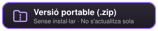
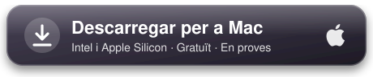

<p align="center">
  
</p>

<h1 align="center">Kylen Chat for Twitch</h1>

<p align="center">
  <a href="README.md"></a>
  <a href="README.en.md"></a>
  
</p>

<p align="center">
  El xat de Twitch damunt del teu joc, amb fons transparent.<br>
  Per a streamers amb una sola pantalla que no volen mirar el xat al mòbil.
</p>

<h2 align="center">DESCÀRREGUES</h2>

<h3 align="center">Windows 10 i 11</h3>
<p align="center">
  <a href="https://github.com/AleixAj/kylenchat/releases/latest/download/KylenChat-Setup.exe">
    
  </a>
</p>
<p align="center">
  <a href="https://github.com/AleixAj/kylenchat/releases/latest/download/KylenChat-Portable.zip">
    
  </a>
</p>

<h3 align="center">macOS 11 o posterior</h3>
<p align="center">
  <a href="https://github.com/AleixAj/kylenchat/releases/latest/download/KylenChat-Mac.dmg">
    
  </a>
</p>
<p align="center">
  <sub><a href="#mac-en-proves">Llegeix això abans d'instal·lar al Mac</a> · <a href="https://github.com/AleixAj/kylenchat/releases">Totes les versions</a></sub>
</p>

## Així es veu

<p align="center">
  
</p>
<p align="center">
  <sub>El xat damunt d'una partida, alineat a la dreta, en mode de prova.</sub>
</p>

---

## Què fa

- Mostra el xat de qualsevol canal de Twitch en una finestra **transparent** que queda **sempre per sobre** del joc.
- Els clics **travessen** el xat, de manera que no molesta mentre jugues.
- Mostra els emotes de **Twitch, 7TV, BTTV i FFZ**.
- Una barra discreta **"Kylen Chat"** damunt del xat mostra el canal connectat i, si estàs en directe, **els teus espectadors**.

**Perquè no et perdis el que és important**
- **Mencions i paraules clau destacades**: si algú escriu el teu nom o una paraula que triïs, el missatge surt ressaltat.
- Marca el **primer missatge** de cada persona, perquè la puguis saludar.
- **Insígnies** de streamer, moderador, VIP i subscriptor.
- Destaca **subs, regals, raids, bits, bescanvis de punts i missatges destacats**, i mostra a qui respon cada missatge.
- **Avisos de directe**: apunta els canals que segueixes i t'avisa tan bon punt comencen directe, amb un requadre damunt del joc i so.
- En el **xat compartit**, cada missatge mostra la icona del canal d'on ve.
- Els noms amb **pintura de 7TV** (degradats) es veuen amb els seus colors.

**Al teu gust**
- **13 estils ràpids** amb un clic, cadascun amb la seva pròpia font i colors: Por defecto (per defecte), Clásico Twitch (Twitch clàssic), Alto contraste (alt contrast), Texto grande (text gran), Terminal, Sakura 🌸, Neón ⚡ (neó), Rúnico ⚔️ (rúnic), Viñeta 💬 (vinyeta), Glaciar ❄️ (glacera), Bosque 🌿 (bosc), Pizarra ✏️ (pissarra) i Arcade 👾. Els noms surten així a l'app en castellà (o en anglès, si el sistema és en anglès).
- Control total de la posició, la mida, la font (qualsevol que tinguis instal·lada a l'ordinador), els colors, el fons, el color de la barra, la transparència i la mida dels emotes.
- Missatges **alineats a la dreta** i **els nous a dalt**, si ho prefereixes.
- **Perfils per joc**: desa l'aspecte i la posició per a cada joc i passa d'un a l'altre amb `Ctrl + Alt + P`.
- **Filtres**: silenciar usuaris i amagar bots i ordres. No hi ha filtre de paraules expressament: el streamer ha de veure tot el que li escriuen.
- El que esborra un moderador pot desaparèixer o quedar-se com a **«mensaje borrado»** (missatge esborrat), com prefereixis.
- El xat **s'atenua quan està tranquil** (als 2 minuts; continua llegible) i es recupera amb el missatge següent. Es pot canviar o desactivar.
- **Modo prueba** (mode de prova) amb missatges d'exemple per ajustar-lo veient el resultat final.

**I, a més**
- L'app està en **castellà i anglès** (no en català); la primera vegada tria l'idioma sola segons el del teu sistema.
- **Guia ràpida** la primera vegada i avís de **novetats** després de cada actualització.
- **Exporta i importa** la configuració.
- Es pot **iniciar amb Windows** (amagada a la safata del sistema) o amb el Mac.
- T'**avisa de les versions noves** i les descarregues quan tu vulguis (mai per sorpresa enmig d'una partida). No cal iniciar sessió a Twitch.

## Descàrrega i instal·lació

**Instal·lador (recomanat):**

1. Prem el botó **Descarregar per a Windows** d'aquí dalt.
2. Obre `KylenChat-Setup.exe`. S'instal·la en uns segons i s'obre sola.
3. Si Windows mostra *"Windows ha protegit l'ordinador"*, prem **Més informació → Executa igualment**. Surt perquè l'app encara no té una signatura digital de pagament, no perquè sigui perillosa.

Amb l'instal·lador, l'app **t'avisa quan surt una versió nova**: prems **Descargar** (descarregar) quan no estiguis jugant i després **Reiniciar** per instal·lar-la (o s'instal·la sola quan tanques l'app).

**Versió portable (sense instal·lar):** descarrega `KylenChat-Portable.zip`, descomprimeix-lo on vulguis i obre `Kylen Chat for Twitch.exe`. Aquesta versió **no s'actualitza sola**: per tenir l'última, torna-la a descarregar.

### Mac (en proves)

1. Prem el botó **Descarregar per a Mac** d'aquí dalt. Serveix per a Mac amb Intel i amb Apple Silicon (M1, M2…).
2. Obre `KylenChat-Mac.dmg` i arrossega **Kylen Chat for Twitch** a la carpeta **Aplicacions**.
3. La primera vegada, macOS dirà que no pot comprovar l'app. Ves a **Configuració del Sistema → Privacitat i seguretat**, baixa fins a l'avís de Kylen Chat i prem **Obre igualment**. Surt perquè l'app no té la signatura de pagament d'Apple, no perquè sigui perillosa.

L'app viu a la **barra de menús** (a dalt a la dreta), no al Dock. Al Mac, les dreceres fan servir **Cmd** en lloc de Ctrl i **Option** en lloc d'Alt.

La versió de Mac **t'avisa quan surt una versió nova**, però no s'instal·la sola: el botó **Descargar** (descarregar) obre aquesta pàgina perquè baixis el `.dmg` nou.

> La versió de Mac es crea automàticament i encara no s'ha provat en un Mac real. Si alguna cosa no funciona bé, explica-ho a [Issues](https://github.com/AleixAj/kylenchat/issues).

## Com es fa servir

1. Escriu el nom del teu canal (o enganxa l'enllaç de twitch.tv) i prem **Conectar** (connectar).
2. Prem **Ctrl + Shift + L** per desbloquejar el xat: arrossega'l on vulguis i canvia'n la mida des de la cantonada inferior dreta.
3. Torna a prémer **Ctrl + Shift + L** per fixar-lo.
4. Prem **Modo prueba** (mode de prova) i ajusta la lletra, els colors i la transparència veient com queda. Tot es desa automàticament.

Si tanques la finestra d'ajustos, l'app continua funcionant a la safata del sistema (al costat del rellotge; al Mac, a la barra de menús). Fes clic a la seva icona per tornar-la a obrir.

### Avisos de directe

A la pestanya **Avisos** escriu un canal (o enganxa'n l'enllaç de twitch.tv) i prem **Añadir** (Afegeix). Els que són en directe en aquell moment surten amb un punt vermell. L'app ho comprova cada minut amb una consulta lleugera, sense iniciar sessió a Twitch.

Quan un comença directe t'avisa amb:

- Un **requadre damunt del joc** amb la foto del canal, el títol i el joc. Prem **Mover y ajustar el aviso** (Mou i ajusta l'avís) per col·locar-lo i canviar-ne la mida amb un avís d'exemple. També tries quants segons es queda a la pantalla.
- Un **so**, que pots treure o abaixar de volum.

En obrir l'app només t'avisa dels directes que han començat fa menys de 10 minuts, per no omplir-te d'avisos de cop. Amb **Probar aviso** (Prova l'avís) veus i sents com queda.

### Dreceres

| Drecera | Què fa |
| --- | --- |
| `Ctrl + Shift + L` | Moure el xat i canviar-ne la mida / fixar-lo |
| `Ctrl + Shift + H` | Amagar o mostrar el xat |
| `Ctrl + Alt + P` | Passar al perfil següent |

Al Mac són `Cmd + Shift + L`, `Cmd + Shift + H` i `Cmd + Option + P`. Totes tres **es poden canviar** a Ajustes → General (Ajustos → General): fes clic a la drecera i prem la combinació que vulguis.

### Important per als jocs (League of Legends, etc.)

- Posa el joc en mode **"Sense vores"** (*Borderless*). En pantalla completa exclusiva, Windows no deixa que cap finestra es vegi per sobre.
- A OBS, captura el joc amb **"Captura de joc"** (*Game Capture*). Així el xat no surt al directe. Amb "Captura de pantalla" (*Display Capture*) sí que hi sortiria.

## Em poden banejar?

L'app **no toca el joc**: no en llegeix la memòria, no en modifica els fitxers i no s'hi fica a dins. És una finestra a part, igual que tenir un navegador o Discord per sobre. Tampoc no llegeix dades de la partida ni dona cap avantatge en el joc.

## Rendiment

Està feta per no afectar els FPS ni el ping:

- No fa servir la targeta gràfica: el xat es dibuixa amb el processador, que per a text gasta molt poc.
- En xats molt ràpids agrupa els missatges i actualitza la pantalla unes 6 vegades per segon com a màxim.
- Els emotes animats es poden desactivar als ajustos per gastar encara menys CPU.
- El xat només rep text: gasta menys dades d'internet que una pàgina web.
- Les fonts dels estils només es carreguen quan tries aquell estil.

## Fiabilitat

- Si es talla internet o l'ordinador surt de la suspensió, es torna a connectar sola sense saturar la xarxa i recupera els emotes que no va poder descarregar.
- La finestra del xat mai no li pren el teclat al joc: només el pot tenir mentre la mous.
- Si desconnectes el monitor on era el xat, torna sol a la pantalla principal.
- Els ajustos es desen de manera segura: aguanten tancaments inesperats i reinicis de l'ordinador.
- Un error inesperat mai no t'obre una finestra en ple directe: s'anota en un registre i l'app continua funcionant.

## Resolució de problemes

- **No veig el xat per sobre del joc:** posa el joc en mode **"Sense vores"** (*Borderless*).
- **Una drecera no funciona:** un altre programa ja la fa servir. L'app t'avisa a Ajustes → General (Ajustos → General), i allà mateix la pots canviar per una altra combinació.
- **Alguna cosa no funciona bé:** a `%APPDATA%\Kylen Chat for Twitch\error.log` (al Mac, `~/Library/Application Support/Kylen Chat for Twitch/error.log`) hi ha un registre d'errors. Si obres un avís a [Issues](https://github.com/AleixAj/kylenchat/issues), adjunta'l.

---

## Per a desenvolupadors

Feta amb [Electron](https://www.electronjs.org/). Necessites [Node.js](https://nodejs.org/) 20 o posterior.

```bash
npm install
npm start
```

| Fitxer | Què és |
| --- | --- |
| `main.js` | Procés principal: finestres, safata del sistema, dreceres, ajustos i actualitzacions |
| `overlay.html` / `overlay.js` | La finestra transparent amb el xat (connexió a Twitch i emotes) |
| `panel.html` / `panel.js` | La finestra d'ajustos |
| `i18n.js` | Textos en castellà i anglès |
| `preload.js` | Pont segur entre les finestres i el procés principal |
| `assets/` | Icones, insígnies, banderes i fonts |
| `fonts.css` | Fonts incloses a l'app |

### Crear l'instal·lador

```bash
npm run dist
```

L'instal·lador queda a `dist/`. El de Mac (`npm run dist:mac`) només es pot crear en un Mac; per això el crea GitHub Actions (`.github/workflows/mac.yml`).

### Publicar una versió nova (actualització automàtica)

1. Augmenta el número de `version` a `package.json` (per exemple, de `1.1.0` a `1.1.1`) i afegeix-ne les novetats a `CHANGELOG`, dins d'`i18n.js` (surten a l'app després d'actualitzar).
2. Crea l'instal·lador i puja'l a GitHub com a **esborrany**:

   ```bash
   npm run release
   ```

   Cal la [CLI de GitHub](https://cli.github.com/) (`gh`) amb la sessió iniciada.

   Això puja l'instal·lador, la versió portable, `latest.yml` i el `.blockmap` a un esborrany a [Releases](https://github.com/AleixAj/kylenchat/releases). Encara no el veu ningú. Després llança a GitHub la compilació per a Mac, que afegeix `KylenChat-Mac.dmg`, `KylenChat-Mac.zip` i `latest-mac.yml` al mateix esborrany en uns 10 minuts.
3. Quan vulguis que estigui disponible (i ja hi siguin els fitxers de Mac), obre l'esborrany a GitHub, escriu-hi les novetats i prem **Publish release**.
4. A partir d'aquell moment, la gent la pot descarregar. Les apps ja instal·lades ho comproven en arrencar i cada 4 hores (un fitxer d'1 KB) i avisen als ajustos; la descàrrega només comença quan l'usuari prem **Descargar** (descarregar), i s'instal·la en reiniciar o en tancar l'app.

> No esborris `latest.yml` ni el `.blockmap` de la release: l'actualització automàtica els necessita.

---

## Llicència

[MIT](LICENSE) © Aleix Aj. Pots utilitzar, modificar i compartir el codi sempre que mantinguis l'avís d'autoria.

Inclou aquestes fonts, totes amb llicència [SIL Open Font License 1.1](assets/fonts/) (cadascuna amb el seu fitxer `OFL-*.txt`): Space Grotesk, Inter, Atkinson Hyperlegible, Lilita One, Cascadia Code, Exo 2, Alegreya, Comic Neue, Quicksand, Nunito, Patrick Hand i Press Start 2P.

> Kylen Chat for Twitch és un projecte independent. No està afiliat ni associat a Twitch Interactive, Inc., ni compta amb el seu suport. "Twitch" és una marca registrada de Twitch Interactive, Inc.

<p align="center">Creada per <b>Aleix Aj</b></p>
