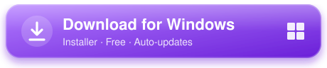
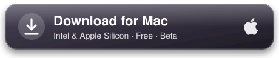

<p align="center">
  
</p>

<h1 align="center">Kylen Chat for Twitch</h1>

<p align="center">
  <sub>Read this page in:</sub>
</p>
<p align="center">
  <a href="README.md"></a>
  
  <a href="README.ca.md"></a>
</p>

<p align="center">
  Your Twitch chat on top of your game, with a transparent background.<br>
  For single-monitor streamers who don't want to read chat on their phone.
</p>

<h2 align="center">DOWNLOADS</h2>

<h3 align="center">Windows 10 and 11</h3>
<p align="center">
  <a href="https://github.com/AleixAj/kylenchat/releases/latest/download/KylenChat-Setup.exe">
    
  </a>
</p>
<p align="center">
  <a href="https://github.com/AleixAj/kylenchat/releases/latest/download/KylenChat-Portable.zip">
    
  </a>
</p>

<h3 align="center">macOS 11 or later</h3>
<p align="center">
  <a href="https://github.com/AleixAj/kylenchat/releases/latest/download/KylenChat-Mac.dmg">
    
  </a>
</p>
<p align="center">
  <sub>The app comes in Spanish and English · <a href="#mac-beta">Read before installing on Mac</a> · <a href="https://github.com/AleixAj/kylenchat/releases">All versions</a></sub>
</p>

## What it looks like

<p align="center">
  
</p>
<p align="center">
  <sub>The chat on top of a match, right-aligned, in preview mode.</sub>
</p>

---

## What it does

- Shows the chat of any Twitch channel in a **transparent** window that stays **always on top** of your game.
- **Several chats at once**: add up to 3 more channels, each in its own window, to follow several streams.
- Clicks **pass through** the chat, so it never gets in the way while you play.
- Shows **Twitch, 7TV, BTTV and FFZ** emotes.
- An unobtrusive **"Kylen Chat"** bar above the chat shows the connected channel and, when you're live, **your viewer count**.

**Never miss what matters**
- **Highlighted mentions and keywords**: if someone writes your name or a word you choose, the message stands out.
- Marks each person's **first message**, so you can greet them.
- **Badges** for streamer, moderator, VIP and subscriber.
- Highlights **subs, gifts, raids, bits, channel point redemptions (including ones without a message, with the reward's name) and highlighted messages**, and shows who each message is replying to.
- **Live alerts**: add the channels you follow and get notified as soon as they go live, with an alert box on top of your game and a sound.
- In **shared chat**, each message shows the icon of the channel it comes from.
- Names with a **7TV paint** (gradients) show their colors.

**Make it yours**
- **Game styles**: your chat with the look of **WoW**, **LoL**, **Valorant**, **Minecraft**, **CS2**, **Overwatch 2**, **Fortnite** or **Rust**: their font, colors, line format and details (buttons, tabs, input box). They can be customized.
- **13 one-click styles**, each with its own font and colors: Default, Big text, Classic Twitch, High contrast, Terminal, Sakura 🌸, Neon ⚡, Runic ⚔️, Comic 💬, Glacier ❄️, Forest 🌿, Chalkboard ✏️ and Arcade 👾.
- **My styles**: save your current look with any name and color you like, and get back to it with one click. The quick styles list can be hidden.
- Full control over position, size, font (any font installed on your computer), colors, background, bar color, transparency and emote size.
- **Right-aligned** messages and **newest on top**, if you prefer.
- **Per-game profiles**: save the look and position for each game and switch with `Ctrl + Alt + P`.
- **Filters**: mute users and hide bots and commands. There's no word filter on purpose: streamers need to see everything people write to them.
- Messages removed by a moderator can disappear or stay as **"message deleted"**, your choice.
- The chat **dims when it's quiet** (after 2 minutes, still readable) and comes back with the next message. You can change or turn this off.
- **Preview mode** with sample messages, so you can tweak it while seeing the final result.

**And also**
- In **Spanish and English**; the first time, it picks your system language automatically.
- A **quick guide** the first time and a **what's new** notice after each update.
- **Export and import** your settings.
- Can **start with Windows** (hidden in the tray) or with your Mac.
- **Tells you about new versions** and you download them whenever you want (never by surprise in the middle of a match). No Twitch login needed.

## Download and install

**Installer (recommended):**

1. Click the **Download for Windows** button above.
2. Open `KylenChat-Setup.exe`. It installs in a few seconds and opens by itself.
3. If Windows shows *"Windows protected your PC"*, click **More info → Run anyway**. This warning appears because the app doesn't have a paid digital signature yet, not because it's dangerous.

With the installer, the app **lets you know when a new version is out**: click **Download** when you're not playing, then **Restart** to install it (or it installs itself when you close the app).

**Portable version (no install):** download `KylenChat-Portable.zip`, unzip it anywhere and open `Kylen Chat for Twitch.exe`. This version **doesn't update itself**: to get the latest one, download it again.

### Mac (beta)

1. Click the **Download for Mac** button above. It works on both Intel and Apple Silicon Macs (M1, M2…).
2. Open `KylenChat-Mac.dmg` and drag **Kylen Chat for Twitch** into the **Applications** folder.
3. The first time, macOS will say it can't verify the app. Go to **System Settings → Privacy & Security**, scroll down to the Kylen Chat notice and click **Open Anyway**. This warning appears because the app doesn't have Apple's paid signature, not because it's dangerous.

The app lives in the **menu bar** (top right), not in the Dock. On Mac, shortcuts use **Cmd** instead of Ctrl and **Option** instead of Alt.

The Mac version **lets you know when a new version is out**, but doesn't install it by itself: the **Download** button opens this page so you can get the new `.dmg`.

> The Mac version is built automatically and hasn't been tested on a real Mac yet. If something doesn't work, please report it in [Issues](https://github.com/AleixAj/kylenchat/issues).

## How to use it

1. Type your channel name (or paste the twitch.tv link) and click **Connect**.
2. Press **Ctrl + Shift + L** to unlock the chat: drag it wherever you want and resize it from the bottom-right corner.
3. Press **Ctrl + Shift + L** again to lock it.
4. Click **Preview mode** and adjust the font, colors and transparency while you see how it looks. Everything saves automatically.

If you close the settings window, the app keeps running in the tray (next to the clock; on Mac, in the menu bar). Click its icon to open it again.

### Several chats and hiding windows

Below the channel, click **+ Add another chat**, type the channel and click **Add chat**: it opens in its own window next to the main one (up to 3 more). They all move together with the move shortcut and share the same look. Mentions of your channel are highlighted in all of them.

Each window has an **eye** button to hide or show it (the main one is next to **Connect**), and the app remembers it after a restart. That way you can keep the app open just for **live alerts**, with no chat window on screen. Hidden extra windows are fully closed and use nothing.

### Live alerts

In the **Alerts** tab, type a channel (or paste its twitch.tv link) and click **Add**. Channels that are live right now show a red dot. The app checks every minute by asking Twitch directly, with a lightweight request, without logging in to Twitch.

When one of them goes live, you get:

- An **alert box on top of your game** with the channel's picture, title and game. Click **Move and resize the alert** to place it and change its size with a sample alert. You also choose how many seconds it stays on screen.
- A **sound**, which you can mute or turn down.

When the app starts, it only alerts you about streams that started less than 10 minutes ago, so you don't get a flood of alerts at once. **Test alert** lets you see and hear how it looks.

### Game styles

In the **Games** tab you pick a style, with a preview of each one:

- **WoW**: narrow font with a shadow, tabs on top and a column of buttons on the left (the friends one shows your viewers). Each line reads `[User] [Name]: text`, with the writer's role (User, Sub, VIP, Mod, Streamer) acting as the channel and names in class colors.
- **LoL**: very dark blue box with a gold border, `[All] Name: text` and names in blue and red like the two teams.
- **Valorant**: dark square-cornered box, DIN-style font, `(All) Name: text` and names in teal and red.
- **Minecraft**: black strips per line, pixel font and `<Name> text`.
- **CS2**: black box with a frame, `[ALL] Name @Sub: text` (the role goes where the game shows the location), names in blue and yellow like the two sides, and a "Say to all" box with "SEND".
- **Overwatch 2**: rounded navy box, an orange diamond before each line, `[Name]: text` in orange and a "[Match]: PRESS TAB TO CYCLE CHANNELS" box.
- **Fortnite**: rounded gray panel, pill-shaped tabs, each person's Twitch profile picture in a circle and an input box with a white border.
- **Rust**: no box, bold narrow font with a black outline, square Twitch profile picture, `[Global] Name: text` and an olive green input bar.

Below you can change the text color, size, background opacity, whether names use the game's colors or Twitch's, the channel tag text and whether the **game details** (buttons, tabs and input box) are shown. They're decorative only: they can't be clicked and clicks still go through the chat.

> Inspired by World of Warcraft, League of Legends, Valorant, Minecraft, Counter-Strike 2, Overwatch 2, Fortnite and Rust. Not affiliated with their makers (Blizzard, Riot Games, Mojang, Valve, Epic Games or Facepunch): the fonts are free lookalikes and the details are drawn for the app. The WoW style uses Arial Narrow if you have it installed.

### Shortcuts

| Shortcut | What it does |
| --- | --- |
| `Ctrl + Shift + L` | Move and resize the chat / lock it |
| `Ctrl + Shift + H` | Hide or show the chat |
| `Ctrl + Alt + P` | Switch to the next profile |

On Mac they are `Cmd + Shift + L`, `Cmd + Shift + H` and `Cmd + Option + P`. All three **can be changed** in Settings → General: click the shortcut and press the combination you want.

### Important for games (League of Legends, etc.)

- Set the game to **"Borderless"** mode. In exclusive fullscreen, Windows doesn't let any window show on top.
- In OBS, capture the game with **"Game Capture"**. That way the chat doesn't show on stream. With "Display Capture" it would.

## Can I get banned?

The app **doesn't touch the game**: it doesn't read its memory, doesn't modify its files and doesn't hook into it. It's a separate window, just like having a browser or Discord on top. It doesn't read match data or give any gameplay advantage either.

## Performance

It's built not to affect your FPS or ping:

- It doesn't use the graphics card: the chat is drawn by the processor, which uses very little for text.
- In very fast chats it groups messages and updates the screen about 6 times per second at most.
- Animated emotes can be turned off in settings to use even less CPU.
- The chat only receives text: it uses less internet than a web page.
- Each style's fonts are only loaded when you pick that style.

## Reliability

- If the internet drops or the computer wakes from sleep, it reconnects by itself without flooding the network, and recovers any emotes it couldn't download.
- The chat window never takes the keyboard away from the game: it can only have it while you're moving it.
- If you unplug the monitor the chat was on, it moves back to the main screen by itself.
- Your settings are saved safely: they survive crashes and computer restarts.
- An unexpected error never pops up a window mid-stream: it's written to a log and the app keeps running.

## Troubleshooting

- **I can't see the chat on top of the game:** set the game to **"Borderless"** mode.
- **A shortcut doesn't work:** another program is already using it. The app tells you in Settings → General, and you can change it to another combination right there.
- **Something isn't working:** there's an error log at `%APPDATA%\Kylen Chat for Twitch\error.log` (on Mac, `~/Library/Application Support/Kylen Chat for Twitch/error.log`). If you open a report in [Issues](https://github.com/AleixAj/kylenchat/issues), attach it.

---

## For developers

Built with [Electron](https://www.electronjs.org/). You need [Node.js](https://nodejs.org/) 20 or later.

```bash
npm install
npm start
```

| File | What it is |
| --- | --- |
| `main.js` | Main process: windows, tray, shortcuts, settings and updates |
| `overlay.html` / `overlay.js` | The transparent chat window (Twitch connection and emotes) |
| `panel.html` / `panel.js` | The settings window |
| `i18n.js` | Spanish and English texts |
| `preload.js` | Secure bridge between the windows and the main process |
| `assets/` | Icons, badges, flags and fonts |
| `fonts.css` | Fonts bundled with the app |

### Build the installer

```bash
npm run dist
```

The installer ends up in `dist/`. The Mac one (`npm run dist:mac`) can only be built on a Mac, so GitHub Actions builds it (`.github/workflows/mac.yml`).

### Publish a new version (automatic updates)

1. Bump `version` in `package.json` (for example, from `1.1.0` to `1.1.1`) and add its changes to `CHANGELOG` in `i18n.js` (they show up in the app after updating).
2. Build the installer and upload it to GitHub as a **draft**:

   ```bash
   npm run release
   ```

   It needs the [GitHub CLI](https://cli.github.com/) (`gh`) signed in.

   This uploads the installer, the portable version, `latest.yml` and the `.blockmap` to a draft in [Releases](https://github.com/AleixAj/kylenchat/releases). Nobody can see it yet. Then it starts the Mac build on GitHub, which adds `KylenChat-Mac.dmg`, `KylenChat-Mac.zip` and `latest-mac.yml` to the same draft in about 10 minutes.
3. When you want it to be available (and the Mac files are there), open the draft on GitHub, write the release notes and click **Publish release**.
4. From then on, people can download it. Installed apps check on startup, every hour and when the settings open (a 1 KB file) and show a notice in settings; the download only starts when the user clicks **Download**, and it installs on restart or when the app closes.

> Don't delete `latest.yml` or the `.blockmap` from the release: automatic updates need them.

---

## License

[MIT](LICENSE) © Aleix Aj. You can use, modify and share the code as long as you keep the copyright notice.

It includes these fonts, all under the [SIL Open Font License 1.1](assets/fonts/) (each with its own `OFL-*.txt` file): Space Grotesk, Inter, Atkinson Hyperlegible, Lilita One, Cascadia Code, Exo 2, Alegreya, Comic Neue, Quicksand, Nunito, Patrick Hand, Press Start 2P, Archivo Narrow, Marcellus, D-DIN, Monocraft, Rajdhani, Jost and Roboto Condensed.

> Kylen Chat for Twitch is an independent project. It is not affiliated with, associated with or endorsed by Twitch Interactive, Inc. "Twitch" is a trademark of Twitch Interactive, Inc.

<p align="center">Made by <b>Aleix Aj</b></p>
