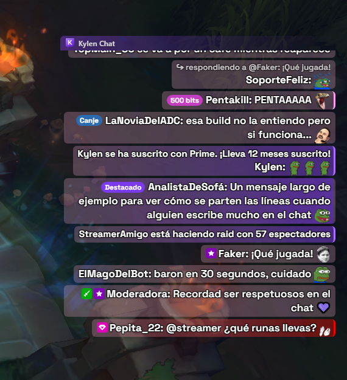

<p align="center">
  
</p>

<h1 align="center">Kylen Chat for Twitch</h1>

<p align="center">
  <sub>Leer esta página en:</sub>
</p>
<p align="center">
  
  <a href="README.en.md"></a>
  <a href="README.ca.md"></a>
</p>

<p align="center">
  El chat de Twitch encima de tu juego, con fondo transparente.<br>
  Para streamers con una sola pantalla que no quieren mirar el chat en el móvil.
</p>

<h2 align="center">DESCARGAS</h2>

<h3 align="center">Windows 10 y 11</h3>
<p align="center">
  <a href="https://github.com/AleixAj/kylenchat/releases/latest/download/KylenChat-Setup.exe">
    
  </a>
</p>
<p align="center">
  <a href="https://github.com/AleixAj/kylenchat/releases/latest/download/KylenChat-Portable.zip">
    
  </a>
</p>

<h3 align="center">macOS 11 o superior</h3>
<p align="center">
  <a href="https://github.com/AleixAj/kylenchat/releases/latest/download/KylenChat-Mac.dmg">
    
  </a>
</p>
<p align="center">
  <sub>La app viene en español e inglés · <a href="#mac-en-pruebas">Leer antes de instalar en Mac</a> · <a href="https://github.com/AleixAj/kylenchat/releases">Todas las versiones</a></sub>
</p>

## Así se ve

<p align="center">
  
</p>
<p align="center">
  <sub>El chat encima de una partida, alineado a la derecha, en modo prueba.</sub>
</p>

---

## Qué hace

- Muestra el chat de cualquier canal de Twitch en una ventana **transparente** que queda **siempre encima** del juego.
- **Varios chats a la vez**: añade hasta 3 canales más, cada uno en su propia ventana, para seguir varios directos.
- Los clics **atraviesan** el chat, así que no molesta mientras juegas.
- Muestra los emotes de **Twitch, 7TV, BTTV y FFZ**.
- Una barra discreta **"Kylen Chat"** encima del chat muestra el canal conectado y, si estás en directo, **tus espectadores**.

**Para no perderte lo importante**
- **Menciones y palabras clave destacadas**: si alguien escribe tu nombre o una palabra que elijas, el mensaje sale resaltado.
- Marca el **primer mensaje** de cada persona, para que puedas saludarla.
- **Insignias** de streamer, moderador, VIP y suscriptor.
- Destaca **subs, regalos, raids, bits, canjes de puntos (también los que no llevan mensaje, con el nombre de la recompensa) y mensajes destacados**, y muestra a quién responde cada mensaje.
- **Avisos de directo**: apunta los canales que sigues y te avisa en cuanto empiezan directo, con un recuadro encima del juego y sonido.
- En **chat compartido**, cada mensaje muestra el icono del canal del que viene.
- Los nombres con **pintura de 7TV** (degradados) se ven con sus colores.

**A tu gusto**
- **Estilos de juegos**: el chat con el aspecto del de **WoW**, **LoL**, **Valorant** o **Minecraft**: su letra, sus colores, su formato de línea y sus detalles (botones, pestañas, casilla de escribir). Se pueden personalizar.
- **13 estilos rápidos** con un clic, cada uno con su propia fuente y colores: Por defecto, Texto grande, Clásico Twitch, Alto contraste, Terminal, Sakura 🌸, Neón ⚡, Rúnico ⚔️, Viñeta 💬, Glaciar ❄️, Bosque 🌿, Pizarra ✏️ y Arcade 👾.
- **Mis estilos**: guarda el aspecto que tengas con el nombre y el color que quieras, y vuelve a él con un clic. La lista de estilos rápidos se puede ocultar.
- Control total de posición, tamaño, fuente (cualquiera instalada en tu PC), colores, fondo, color de la barra, transparencia y tamaño de emotes.
- Mensajes **alineados a la derecha** y **nuevos arriba**, si lo prefieres.
- **Perfiles por juego**: guarda el aspecto y la posición para cada juego y cambia con `Ctrl + Alt + P`.
- **Filtros**: silenciar usuarios y ocultar bots y comandos. No hay filtro de palabras a propósito: el streamer tiene que ver todo lo que le escriben.
- Lo que borra un moderador puede desaparecer o quedarse como **«mensaje borrado»**, a tu elección.
- El chat se **atenúa cuando está tranquilo** (a los 2 minutos, sigue legible) y se recupera con el siguiente mensaje. Se puede cambiar o desactivar.
- **Modo prueba** con mensajes de ejemplo para ajustarlo viendo el resultado final.

**Y además**
- En **español e inglés**; la primera vez elige solo según el idioma de tu sistema.
- **Guía rápida** la primera vez y aviso de **novedades** tras cada actualización.
- **Exporta e importa** tu configuración.
- Puede **iniciarse con Windows** (oculta en la bandeja) o con el Mac.
- Te **avisa de las versiones nuevas** y las descargas cuando tú quieras (nunca por sorpresa en mitad de una partida). No necesitas iniciar sesión en Twitch.

## Descarga e instalación

**Instalador (recomendado):**

1. Pulsa el botón **Descargar para Windows** de arriba.
2. Abre `KylenChat-Setup.exe`. Se instala en unos segundos y se abre sola.
3. Si Windows muestra *"Windows protegió tu PC"*, pulsa **Más información → Ejecutar de todas formas**. Sale porque la app todavía no tiene firma digital de pago, no porque sea peligrosa.

Con el instalador, la app **te avisa cuando sale una versión nueva**: pulsas **Descargar** cuando no estés jugando y luego **Reiniciar** para instalarla (o se instala sola al cerrar la app).

**Versión portable (sin instalar):** descarga `KylenChat-Portable.zip`, descomprímelo donde quieras y abre `Kylen Chat for Twitch.exe`. Esta versión **no se actualiza sola**: para tener la última, vuelve a descargarla.

### Mac (en pruebas)

1. Pulsa el botón **Descargar para Mac** de arriba. Vale para Mac con Intel y con Apple Silicon (M1, M2…).
2. Abre `KylenChat-Mac.dmg` y arrastra **Kylen Chat for Twitch** a la carpeta **Aplicaciones**.
3. La primera vez, macOS dirá que no puede comprobar la app. Ve a **Ajustes del Sistema → Privacidad y seguridad**, baja hasta el aviso de Kylen Chat y pulsa **Abrir igualmente**. Sale porque la app no tiene la firma de pago de Apple, no porque sea peligrosa.

La app vive en la **barra de menú** (arriba a la derecha), no en el Dock. En Mac los atajos usan **Cmd** en vez de Ctrl y **Option** en vez de Alt.

La versión de Mac **te avisa cuando sale una versión nueva**, pero no se instala sola: el botón **Descargar** abre esta página para bajar el `.dmg` nuevo.

> La versión de Mac se crea automáticamente y todavía no se ha probado en un Mac real. Si algo no va bien, cuéntalo en [Issues](https://github.com/AleixAj/kylenchat/issues).

## Cómo se usa

1. Escribe el nombre de tu canal (o pega el enlace de twitch.tv) y pulsa **Conectar**.
2. Pulsa **Ctrl + Shift + L** para desbloquear el chat: arrástralo donde quieras y cambia su tamaño desde la esquina de abajo a la derecha.
3. Vuelve a pulsar **Ctrl + Shift + L** para fijarlo.
4. Pulsa **Modo prueba** y ajusta la letra, los colores y la transparencia viendo cómo queda. Todo se guarda solo.

Si cierras la ventana de ajustes, la app sigue funcionando en la bandeja (junto al reloj; en Mac, en la barra de menú). Haz clic en su icono para volver a abrirla.

### Varios chats y ocultar ventanas

Debajo del canal, pulsa **+ Añadir otro chat**, escribe el canal y pulsa **Añadir chat**: se abre en una ventana aparte, al lado de la principal (hasta 3 más). Todas se mueven a la vez con el atajo de mover y usan el mismo aspecto. Las menciones a tu canal se destacan en todas.

Cada ventana tiene un **ojo** para ocultarla o mostrarla (el de la principal está junto a **Conectar**), y la app lo recuerda al reiniciar. Así puedes dejar la app abierta solo para los **avisos de directo**, sin ninguna ventana de chat a la vista. Las ventanas extra ocultas se cierran del todo y no gastan nada.

### Avisos de directo

En la pestaña **Avisos** escribe un canal (o pega su enlace de twitch.tv) y pulsa **Añadir**. Los que están en directo en ese momento salen con un punto rojo. La app lo comprueba cada minuto preguntando a Twitch directamente, con una consulta ligera, sin iniciar sesión en Twitch.

Cuando uno empieza directo te avisa con:

- Un **recuadro encima del juego** con la foto del canal, el título y el juego. Pulsa **Mover y ajustar el aviso** para colocarlo y cambiar su tamaño con un aviso de ejemplo. También eliges cuántos segundos se queda en pantalla.
- Un **sonido**, que puedes quitar o bajar de volumen.

Al abrir la app solo te avisa de los directos que empezaron hace menos de 10 minutos, para no llenarte de avisos de golpe. Con **Probar aviso** ves y oyes cómo queda.

### Estilos de juegos

En la pestaña **Juegos** eliges el estilo con una vista previa de cada uno:

- **WoW**: letra estrecha con sombra, pestañas arriba y columna de botones a la izquierda (el de amigos muestra tus espectadores). Cada línea sale como `[Usuario] [Nombre]: texto`, con el papel de quien escribe (Usuario, Sub, VIP, Mod, Streamer) como si fuera el canal y los nombres con colores de clase.
- **LoL**: recuadro azul muy oscuro con borde dorado, `[Todos] Nombre: texto` y nombres en azul y rojo como los dos equipos.
- **Valorant**: recuadro oscuro de esquinas rectas, letra tipo DIN, `(Todos) Nombre: texto` y nombres en turquesa y rojo.
- **Minecraft**: franjas negras por línea, letra pixelada y `<Nombre> texto`.

Debajo puedes cambiar el color del texto, el tamaño, la opacidad del fondo, si los nombres usan los colores del juego o los de Twitch, y el texto de la etiqueta del canal. Los botones y casillas son solo decorativos: no se pueden pulsar y los clics siguen atravesando el chat.

> Inspirados en World of Warcraft, League of Legends, Valorant y Minecraft. No están afiliados a Blizzard, Riot Games ni Mojang: las fuentes son libres y parecidas a las originales, y los detalles están dibujados para la app. En WoW se usa Arial Narrow si la tienes instalada.

### Atajos

| Atajo | Qué hace |
| --- | --- |
| `Ctrl + Shift + L` | Mover y cambiar el tamaño del chat / fijarlo |
| `Ctrl + Shift + H` | Ocultar o mostrar el chat |
| `Ctrl + Alt + P` | Pasar al siguiente perfil |

En Mac son `Cmd + Shift + L`, `Cmd + Shift + H` y `Cmd + Option + P`. Los tres **se pueden cambiar** en Ajustes → General: haz clic en el atajo y pulsa la combinación que quieras.

### Importante para juegos (League of Legends, etc.)

- Pon el juego en modo **"Sin bordes"** (*Borderless*). En pantalla completa exclusiva, Windows no deja que ninguna ventana se vea encima.
- En OBS, captura el juego con **"Captura de juego"**. Así el chat no sale en el directo. Con "Captura de pantalla" sí saldría.

## ¿Me pueden banear?

La app **no toca el juego**: no lee su memoria, no modifica sus archivos y no se mete dentro de él. Es una ventana aparte, igual que tener un navegador o Discord encima. Tampoco lee datos de la partida ni da ninguna ventaja al jugar.

## Rendimiento

Está hecha para no afectar a los FPS ni al ping:

- No usa la tarjeta gráfica: el chat se dibuja con el procesador, que para texto gasta muy poco.
- En chats muy rápidos agrupa los mensajes y actualiza la pantalla unas 6 veces por segundo como mucho.
- Los emotes animados se pueden desactivar en ajustes para gastar aún menos CPU.
- El chat solo recibe texto: gasta menos internet que una página web.
- Las fuentes de los estilos solo se cargan cuando eliges ese estilo.

## Fiabilidad

- Si se corta internet o el PC vuelve de suspensión, se reconecta sola sin saturar la red, y recupera los emotes que no pudo descargar.
- La ventana del chat nunca le quita el teclado al juego: solo puede tenerlo mientras la estás moviendo.
- Si desconectas el monitor donde estaba el chat, vuelve solo a la pantalla principal.
- Tus ajustes se guardan de forma segura: aguantan cierres inesperados y reinicios del PC.
- Un error inesperado nunca te saca una ventana en pleno directo: se apunta en un registro y la app sigue funcionando.

## Solución de problemas

- **No veo el chat encima del juego:** pon el juego en modo **"Sin bordes"**.
- **Un atajo no funciona:** otro programa ya lo usa. La app te avisa en Ajustes → General, y ahí mismo puedes cambiarlo por otra combinación.
- **Algo no va bien:** en `%APPDATA%\Kylen Chat for Twitch\error.log` (en Mac, `~/Library/Application Support/Kylen Chat for Twitch/error.log`) hay un registro de errores. Si abres un aviso en [Issues](https://github.com/AleixAj/kylenchat/issues), adjúntalo.

---

## Para desarrolladores

Hecha con [Electron](https://www.electronjs.org/). Necesitas [Node.js](https://nodejs.org/) 20 o superior.

```bash
npm install
npm start
```

| Archivo | Qué es |
| --- | --- |
| `main.js` | Proceso principal: ventanas, bandeja, atajos, ajustes y actualizaciones |
| `overlay.html` / `overlay.js` | La ventana transparente con el chat (conexión a Twitch y emotes) |
| `panel.html` / `panel.js` | La ventana de ajustes |
| `i18n.js` | Textos en español e inglés |
| `preload.js` | Puente seguro entre las ventanas y el proceso principal |
| `assets/` | Iconos, insignias, banderas y fuentes |
| `fonts.css` | Fuentes incluidas en la app |

### Crear el instalador

```bash
npm run dist
```

El instalador queda en `dist/`. El de Mac (`npm run dist:mac`) solo se puede crear en un Mac; por eso lo crea GitHub Actions (`.github/workflows/mac.yml`).

### Publicar una versión nueva (actualización automática)

1. Sube el número de `version` en `package.json` (por ejemplo, de `1.1.0` a `1.1.1`) y añade sus novedades en `CHANGELOG` dentro de `i18n.js` (salen en la app tras actualizar).
2. Crea el instalador y súbelo a GitHub como **borrador**:

   ```bash
   npm run release
   ```

   Necesita la [CLI de GitHub](https://cli.github.com/) (`gh`) con la sesión iniciada.

   Esto sube el instalador, la versión portable, `latest.yml` y el `.blockmap` a un borrador en [Releases](https://github.com/AleixAj/kylenchat/releases). Nadie lo ve todavía. Después lanza en GitHub la compilación para Mac, que añade `KylenChat-Mac.dmg`, `KylenChat-Mac.zip` y `latest-mac.yml` al mismo borrador en unos 10 minutos.
3. Cuando quieras que esté disponible (y ya estén los archivos de Mac), abre el borrador en GitHub, escribe las novedades y pulsa **Publish release**.
4. Desde ese momento, la gente puede descargarla. Las apps ya instaladas lo comprueban al arrancar, cada hora y al abrir los ajustes (un archivo de 1 KB) y avisan en los ajustes; la descarga solo empieza cuando el usuario pulsa **Descargar**, y se instala al reiniciar o al cerrar la app.

> No borres `latest.yml` ni el `.blockmap` de la release: la actualización automática los necesita.

---

## Licencia

[MIT](LICENSE) © Aleix Aj. Puedes usar, modificar y compartir el código siempre que mantengas el aviso de autoría.

Incluye estas fuentes, todas con licencia [SIL Open Font License 1.1](assets/fonts/) (cada una con su archivo `OFL-*.txt`): Space Grotesk, Inter, Atkinson Hyperlegible, Lilita One, Cascadia Code, Exo 2, Alegreya, Comic Neue, Quicksand, Nunito, Patrick Hand, Press Start 2P, Archivo Narrow, Marcellus, D-DIN y Monocraft.

> Kylen Chat for Twitch es un proyecto independiente. No está afiliado, asociado ni respaldado por Twitch Interactive, Inc. "Twitch" es una marca registrada de Twitch Interactive, Inc.

<p align="center">Creada por <b>Aleix Aj</b></p>
