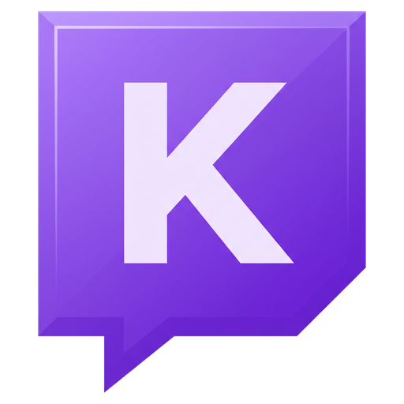

<p align="center">
  
</p>

<h1 align="center">Kylen Chat for Twitch</h1>

<p align="center">
  El chat de Twitch encima de tu juego, con fondo transparente.<br>
  Para streamers con una sola pantalla que no quieren mirar el chat en el móvil.
</p>

<h2 align="center">DESCARGAS</h2>

<p align="center">
  <a href="https://github.com/AleixAj/kylentwitchchat/releases/latest/download/KylenChat-Setup.exe">
    
  </a>
</p>
<p align="center">
  <a href="https://github.com/AleixAj/kylentwitchchat/releases/latest/download/KylenChat-Portable.zip">
    
  </a>
</p>
<p align="center">
  <sub>Windows 10 y 11 · Gratis · <a href="https://github.com/AleixAj/kylentwitchchat/releases">Todas las versiones</a></sub>
</p>

---

## Qué hace

- Muestra el chat de cualquier canal de Twitch en una ventana **transparente** que queda **siempre encima** del juego.
- Los clics **atraviesan** el chat, así que no molesta mientras juegas.
- Muestra los emotes de **Twitch, 7TV, BTTV y FFZ**.
- Una barra discreta **"Kylen Chat"** encima del chat muestra el canal conectado.

**Para no perderte lo importante**
- **Menciones y palabras clave destacadas**: si alguien escribe tu nombre o una palabra que elijas, el mensaje sale resaltado.
- Marca el **primer mensaje** de cada persona, para que puedas saludarla.
- **Insignias** de streamer, moderador, VIP y suscriptor.
- Destaca **subs, regalos, raids, bits, canjes de puntos y mensajes destacados**, y muestra a quién responde cada mensaje.

**A tu gusto**
- **7 estilos rápidos** con un clic: Por defecto, Minimalista, Clásico Twitch, Alto contraste, Texto grande, Terminal y Sakura 🌸.
- Control total de posición, tamaño, fuente (cualquiera instalada en tu PC), colores, fondo, transparencia y tamaño de emotes.
- Mensajes **alineados a la derecha** y **nuevos arriba**, si lo prefieres.
- **Perfiles por juego**: guarda el aspecto y la posición para cada juego y cambia con `Ctrl + Alt + P`.
- **Filtros**: silenciar usuarios y ocultar bots y comandos. No hay filtro de palabras a propósito: el streamer tiene que ver todo lo que le escriben.
- El chat puede **atenuarse cuando está tranquilo** (sigue legible) y recuperarse con el siguiente mensaje.
- **Modo prueba** con mensajes de ejemplo para ajustarlo viendo el resultado final.

**Y además**
- En **español e inglés**.
- **Guía rápida** la primera vez y aviso de **novedades** tras cada actualización.
- **Exporta e importa** tu configuración.
- Puede **iniciarse con Windows**, oculta en la bandeja.
- Se **actualiza sola** y no necesitas iniciar sesión en Twitch.

## Descarga e instalación

**Instalador (recomendado):**

1. Pulsa el botón **Descargar para Windows** de arriba.
2. Abre `KylenChat-Setup.exe`. Se instala en unos segundos y se abre sola.
3. Si Windows muestra *"Windows protegió tu PC"*, pulsa **Más información → Ejecutar de todas formas**. Sale porque la app todavía no tiene firma digital de pago, no porque sea peligrosa.

Con el instalador, la app **se actualiza sola** cuando sale una versión nueva.

**Versión portable (sin instalar):** descarga `KylenChat-Portable.zip`, descomprímelo donde quieras y abre `Kylen Chat for Twitch.exe`. Esta versión **no se actualiza sola**: para tener la última, vuelve a descargarla.

## Cómo se usa

1. Escribe el nombre de tu canal (o pega el enlace de twitch.tv) y pulsa **Conectar**.
2. Pulsa **Ctrl + Shift + L** para desbloquear el chat: arrástralo donde quieras y cambia su tamaño desde la esquina de abajo a la derecha.
3. Vuelve a pulsar **Ctrl + Shift + L** para fijarlo.
4. Pulsa **Modo prueba** y ajusta la letra, los colores y la transparencia viendo cómo queda. Todo se guarda solo.

Si cierras la ventana de ajustes, la app sigue funcionando en la bandeja (junto al reloj). Haz clic en su icono para volver a abrirla.

### Atajos

| Atajo | Qué hace |
| --- | --- |
| `Ctrl + Shift + L` | Mover y cambiar el tamaño del chat / fijarlo |
| `Ctrl + Shift + H` | Ocultar o mostrar el chat |
| `Ctrl + Alt + P` | Pasar al siguiente perfil |

### Importante para juegos (League of Legends, etc.)

- Pon el juego en modo **"Sin bordes"** (*Borderless*). En pantalla completa exclusiva, Windows no deja que ninguna ventana se vea encima.
- En OBS, captura el juego con **"Captura de juego"**. Así el chat no sale en el directo. Con "Captura de pantalla" sí saldría.

## ¿Me pueden banear?

La app **no toca el juego**: no lee su memoria, no modifica sus archivos y no se mete dentro de él. Es una ventana aparte, igual que tener un navegador o Discord encima. Tampoco lee datos de la partida ni da ninguna ventaja al jugar.

## Rendimiento

Está hecha para no afectar a los FPS ni al ping:

- No usa la tarjeta gráfica: el chat se dibuja con el procesador, que para texto gasta muy poco.
- En chats muy rápidos agrupa los mensajes y actualiza la pantalla unas 6 veces por segundo como mucho.
- Los emotes animados están desactivados por defecto (se pueden activar en ajustes).
- El chat solo recibe texto: gasta menos internet que una página web.
- Si se corta internet o el PC vuelve de suspensión, se reconecta sola sin saturar la red.

---

## Para desarrolladores

Hecha con [Electron](https://www.electronjs.org/). Necesitas [Node.js](https://nodejs.org/) 20 o superior.

```bash
npm install
npm start
```

| Archivo | Qué es |
| --- | --- |
| `main.js` | Proceso principal: ventanas, bandeja, atajos, ajustes y actualizaciones |
| `overlay.html` / `overlay.js` | La ventana transparente con el chat (conexión a Twitch y emotes) |
| `panel.html` / `panel.js` | La ventana de ajustes |
| `i18n.js` | Textos en español e inglés |
| `preload.js` | Puente seguro entre las ventanas y el proceso principal |
| `assets/` | Iconos, insignias, banderas y la fuente Space Grotesk |

### Crear el instalador

```bash
npm run dist
```

El instalador queda en `dist/`.

### Publicar una versión nueva (actualización automática)

1. Sube el número de `version` en `package.json` (por ejemplo, de `1.1.0` a `1.1.1`) y añade sus novedades en `CHANGELOG` dentro de `i18n.js` (salen en la app tras actualizar).
2. Crea el instalador y súbelo a GitHub como **borrador**:

   ```bash
   npm run release
   ```

   Necesita la [CLI de GitHub](https://cli.github.com/) (`gh`) con la sesión iniciada.

   Esto sube el instalador, la versión portable, `latest.yml` y el `.blockmap` a un borrador en [Releases](https://github.com/AleixAj/kylentwitchchat/releases). Nadie lo ve todavía.
3. Cuando quieras que esté disponible, abre el borrador en GitHub, escribe las novedades y pulsa **Publish release**.
4. Desde ese momento, la gente puede descargarla y las apps ya instaladas se actualizan solas: buscan versiones nuevas al arrancar y cada 4 horas, la descargan y avisan para reiniciar. Si no se reinicia, se instala al cerrar la app.

> No borres `latest.yml` ni el `.blockmap` de la release: la actualización automática los necesita.

---

## Licencia

[MIT](LICENSE) © Aleix Aj. Puedes usar, modificar y compartir el código siempre que mantengas el aviso de autoría.

Incluye la fuente [Space Grotesk](https://github.com/floriankarsten/space-grotesk) (© The Space Grotesk Project Authors), con licencia [SIL Open Font License 1.1](assets/fonts/OFL.txt).

> Kylen Chat for Twitch es un proyecto independiente. No está afiliado, asociado ni respaldado por Twitch Interactive, Inc. "Twitch" es una marca registrada de Twitch Interactive, Inc.

<p align="center">Creada por <b>Aleix Aj</b></p>
